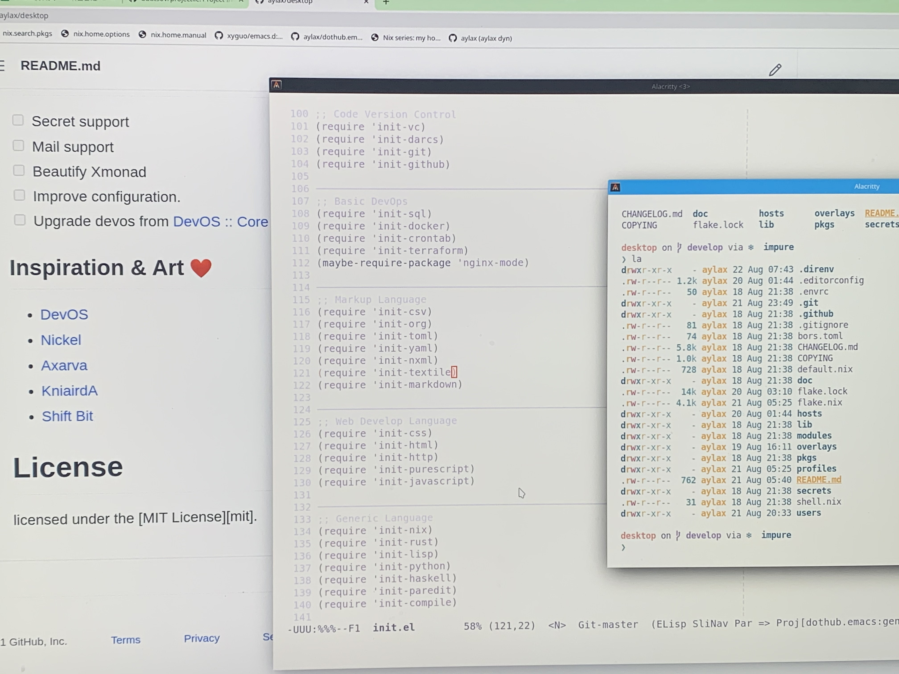

# AyLax's Desktop

## Getting Started
- [master](https://github.com/aylax/desktop.git) 
- [develop](https://github.com/aylax/desktop.git)

## Screen Shot

  

## Guide
[guide](https://devos.divnix.com/start)

## Todo
- [ ] Secret support
- [ ] Mail support
- [ ] Beautify Xmonad
- [ ] Improve configuration.
- [ ] Upgrade devos from [DevOS :: Core](https://github.com/divnix/devos.git)
to [DevOS :: Main](https://github.com/divnix/devos.git)

## Inspiration & Art :heart:
- [DevOS](https://github.com/divnix/devos)
- [Nickel](https://github.com/tweag/nickel)
- [Axarva](https://github.com/Axarva/dotfiles-2.0)
- [KniairdA](https://github.com/KnairdA/nixos_home)
- [Shift Bit](https://github.com/ShifterBit/nixos-config-devos)

# License
licensed under the [MIT License][mit].

